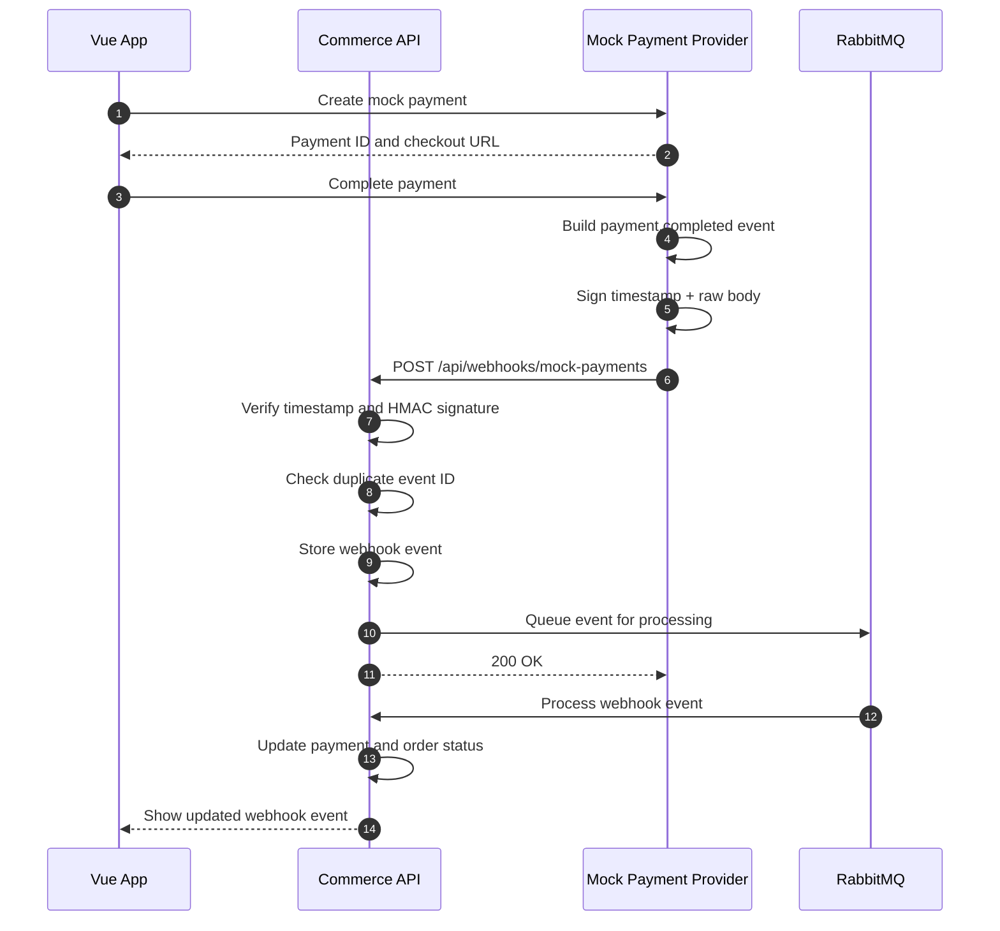

# Payment Webhook Learning Project

A small full-stack project for learning how payment webhooks work.

The system has:

- `commerce-api` - Java Spring Boot backend that receives and verifies webhooks.
- `mock-payment-provider` - Java Spring Boot service that simulates a payment provider.
- `commerce-web` - Vue 3 app for testing the payment flow.
- `postgres` - database for future persistent storage.
- `rabbitmq` - message queue for future async webhook processing.

> This project is for learning only. It uses simulated payments and must not process real card data or real money.

## Webhook Summary

The customer starts a payment from the Vue app. The mock provider marks the payment as completed, signs a webhook payload with HMAC-SHA256, and sends it to the Commerce API.

The Commerce API should:

- Read the raw webhook body.
- Verify the timestamp and signature.
- Reject invalid or expired webhooks.
- Store the event.
- Ignore duplicate event IDs.
- Process the payment status update.
- Return `200 OK` quickly for valid events.

## Webhook Sequence Diagram



More detailed diagrams are in [WEBHOOK_SEQUENCE_DIAGRAM.md](WEBHOOK_SEQUENCE_DIAGRAM.md).

## Run With Docker

Start Docker Desktop first, then run:

```bash
docker compose up --build
```

Open the web app:

```text
http://localhost:5173
```

Useful local URLs:

```text
Commerce API:           http://localhost:8080
Mock Payment Provider:  http://localhost:8081
Vue Web App:            http://localhost:5173
RabbitMQ UI:            http://localhost:15672
```

## Useful Endpoints

```http
GET  http://localhost:8080/api/health
POST http://localhost:8080/api/orders
GET  http://localhost:8080/api/orders
POST http://localhost:8080/api/orders/{orderId}/payments
GET  http://localhost:8080/api/payments
GET  http://localhost:8080/api/admin/webhook-events

GET  http://localhost:8081/api/health
POST http://localhost:8081/api/mock-payments
POST http://localhost:8081/api/mock-payments/{paymentId}/complete
```

Example mock payment request:

```json
{
  "orderId": "order_1001",
  "amount": 29.99,
  "currency": "USD"
}
```

Duplicate order IDs are rejected by the Commerce API with `409 Conflict` and `duplicate_order_id`.

## Webhook Payload Example

```json
{
  "eventId": "evt_123456",
  "eventType": "payment.completed",
  "createdAt": "2026-08-19T10:30:00Z",
  "data": {
    "paymentId": "pay_987654",
    "orderId": "order_1001",
    "amount": 29.99,
    "currency": "USD",
    "status": "COMPLETED"
  }
}
```

Webhook headers:

```http
Content-Type: application/json
X-Webhook-Id: evt_123456
X-Webhook-Timestamp: 1787135400
X-Webhook-Signature: sha256=<calculated-hmac>
```

## Local Environment

The project uses `.env` for local Docker Compose values. A safe example is available in [.env.example](.env.example).

Important values:

```dotenv
WEBHOOK_SECRET=local-dev-webhook-secret-change-me
COMMERCE_WEBHOOK_URL=http://commerce-api:8080/api/webhooks/mock-payments
MOCK_PROVIDER_BASE_URL=http://mock-payment-provider:8081
```

Do not commit real production secrets.

## Current Status

Implemented:

- Initial Commerce API scaffold.
- Initial Mock Payment Provider scaffold.
- Initial Vue testing UI.
- HMAC webhook signing and verification.
- In-memory webhook event storage.
- Docker Compose setup.

Next steps:

- Persist events in PostgreSQL.
- Publish and consume events through RabbitMQ.
- Add real order and payment tables.
- Add authentication.
- Add retry and dead-letter queue handling.
- Add integration tests.
