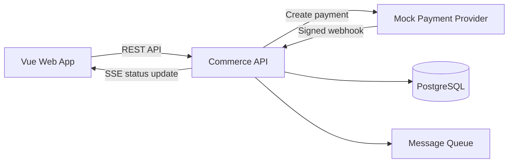
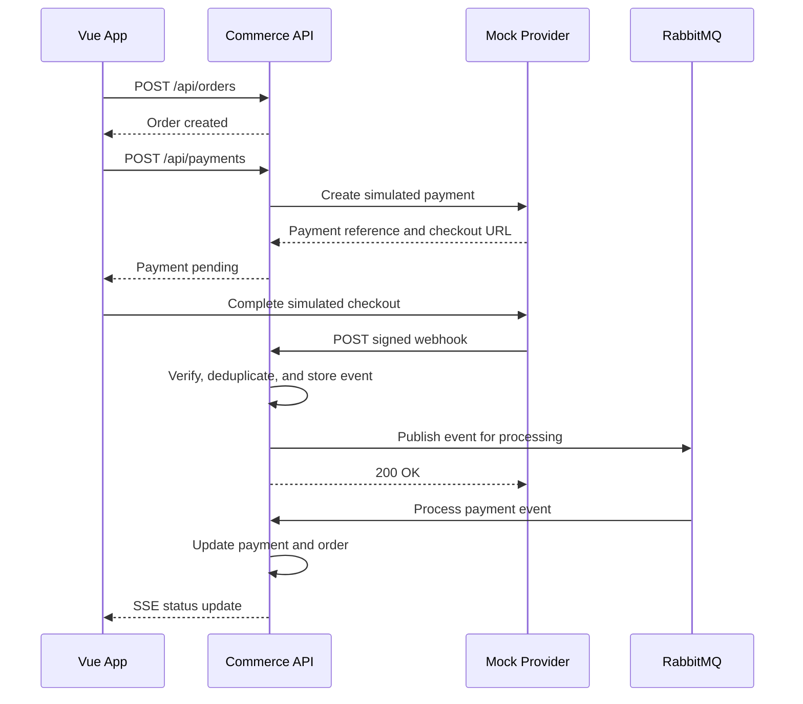

https://github.com/vaungsophal/psl-webhook-payment/invitations

# Payment Webhook Learning Project

Build a full-stack payment and order-processing system with a **Java Spring Boot backend** and a **Vue frontend**. The purpose is to learn REST APIs, database design, asynchronous processing, authentication, real-time UI updates, and reliable webhook handling.

> This is a learning project. Use a simulated payment provider and test data only. Do not process real card details or real money.

## 1. Project goal

A customer places an order and starts a simulated payment. The payment provider processes it asynchronously and sends a webhook to the main application. The application verifies the webhook, records it, updates the payment and order, and displays the new status in Vue.

By completing this project, you should understand:

- How REST APIs differ from webhooks
- How to send and receive webhooks
- HMAC signature verification
- Idempotency and duplicate-event protection
- Asynchronous event processing
- Retry strategies and dead-letter queues
- Database transactions and state transitions
- Authentication and authorization
- Real-time frontend updates
- Integration and end-to-end testing

## 2. System components

Create two backend services and one frontend:

1. **Commerce API** — the main Spring Boot application containing users, products, orders, payments, and the webhook receiver.
2. **Mock Payment Provider** — a small Spring Boot service that simulates a payment platform and sends signed webhooks.
3. **Commerce Web App** — a Vue 3 application for customers and administrators.



## 3. Recommended technology

### Backend

- Java 21
- Spring Boot 3
- Maven
- Spring Web
- Spring Data JPA
- Spring Security with JWT
- Bean Validation
- PostgreSQL
- RabbitMQ
- Flyway database migrations
- springdoc-openapi/Swagger UI
- JUnit 5 and Mockito
- Testcontainers

### Frontend

- Vue 3
- TypeScript
- Vite
- Vue Router
- Pinia
- Axios
- Tailwind CSS or PrimeVue
- Server-Sent Events for live status updates

### Development tools

- Docker and Docker Compose
- Git and GitHub
- Postman or Bruno
- IntelliJ IDEA or VS Code

## 4. Main user stories

### Customer

- I can register and log in.
- I can browse available products.
- I can add products to my cart.
- I can create an order.
- I can start a simulated payment.
- I can see whether the payment is pending, completed, or failed.
- I can review my order history.

### Administrator

- I can create, update, and deactivate products.
- I can review orders and payments.
- I can inspect received webhook events.
- I can see whether an event was processed, failed, or ignored as a duplicate.
- I can retry a failed event.

## 5. Payment flow



The webhook endpoint should acknowledge a valid event quickly. Long-running business logic should happen after the event has been stored or queued.

## Current scaffold

This repository now includes an initial runnable skeleton:

- `commerce-api` - Spring Boot service with health, webhook receive, signature verification, and in-memory webhook-event storage.
- `mock-payment-provider` - Spring Boot service that creates mock payments and sends signed `payment.completed` webhooks.
- `commerce-web` - Vue 3 + Vite UI for creating a mock payment, completing it, and viewing received webhook events.
- `docker-compose.yml` - local stack with Commerce API, Mock Payment Provider, Vue app, PostgreSQL, and RabbitMQ.

Start the full stack with Docker:

```bash
docker compose up --build
```

Then open:

```text
http://localhost:5173
```

Useful endpoints:

```http
GET  http://localhost:8080/api/health
GET  http://localhost:8080/api/admin/webhook-events
GET  http://localhost:8081/api/health
POST http://localhost:8081/api/mock-payments
POST http://localhost:8081/api/mock-payments/{paymentId}/complete
```

## 6. Suggested repository structure

```text
payment-webhook-learning-project/
├── commerce-api/
│   ├── src/main/java/...
│   ├── src/main/resources/
│   └── pom.xml
├── mock-payment-provider/
│   ├── src/main/java/...
│   ├── src/main/resources/
│   └── pom.xml
├── commerce-web/
│   ├── src/
│   └── package.json
├── docker-compose.yml
├── .env.example
└── README.md
```

Suggested Commerce API packages:

```text
config/
auth/
user/
product/
order/
payment/
webhook/
notification/
common/
```

Organize each feature into controller, service, repository, entity, and DTO classes where appropriate. Do not expose JPA entities directly through the API.

## 7. Database design

### `users`

| Column | Type | Notes |
|---|---|---|
| id | UUID | Primary key |
| email | VARCHAR | Unique |
| password_hash | VARCHAR | Never store plain passwords |
| role | VARCHAR | CUSTOMER or ADMIN |
| created_at | TIMESTAMP | Creation time |

### `products`

| Column | Type | Notes |
|---|---|---|
| id | UUID | Primary key |
| name | VARCHAR | Product name |
| description | TEXT | Optional |
| price | DECIMAL | Use decimal, not floating point |
| active | BOOLEAN | Soft availability control |

### `orders`

| Column | Type | Notes |
|---|---|---|
| id | UUID | Primary key |
| user_id | UUID | Foreign key |
| status | VARCHAR | CREATED, PAYMENT_PENDING, PAID, PAYMENT_FAILED, CANCELLED |
| total_amount | DECIMAL | Calculated on the backend |
| currency | VARCHAR | For example USD |
| created_at | TIMESTAMP | Creation time |
| updated_at | TIMESTAMP | Last update |

### `order_items`

| Column | Type | Notes |
|---|---|---|
| id | UUID | Primary key |
| order_id | UUID | Foreign key |
| product_id | UUID | Foreign key |
| quantity | INTEGER | Must be positive |
| unit_price | DECIMAL | Snapshot price at purchase time |

### `payments`

| Column | Type | Notes |
|---|---|---|
| id | UUID | Internal payment ID |
| order_id | UUID | Unique foreign key |
| provider_payment_id | VARCHAR | ID returned by provider |
| status | VARCHAR | PENDING, COMPLETED, FAILED, REFUNDED |
| amount | DECIMAL | Expected amount |
| currency | VARCHAR | Expected currency |
| provider_event_time | TIMESTAMP | Helps manage event ordering |
| created_at | TIMESTAMP | Creation time |
| updated_at | TIMESTAMP | Last update |

### `webhook_events`

| Column | Type | Notes |
|---|---|---|
| id | UUID | Internal ID |
| provider_event_id | VARCHAR | Unique idempotency constraint |
| event_type | VARCHAR | For example `payment.completed` |
| payload | JSONB | Original event payload |
| status | VARCHAR | RECEIVED, PROCESSING, PROCESSED, FAILED, IGNORED |
| attempt_count | INTEGER | Processing attempts |
| error_message | TEXT | Last failure reason |
| received_at | TIMESTAMP | Receipt time |
| processed_at | TIMESTAMP | Completion time |

## 8. REST API design

### Authentication

```http
POST /api/auth/register
POST /api/auth/login
GET  /api/auth/me
```

### Products

```http
GET    /api/products
GET    /api/products/{id}
POST   /api/admin/products
PUT    /api/admin/products/{id}
DELETE /api/admin/products/{id}
```

### Orders

```http
POST /api/orders
GET  /api/orders
GET  /api/orders/{id}
POST /api/orders/{id}/cancel
```

### Payments

```http
POST /api/orders/{orderId}/payments
GET  /api/payments/{id}
GET  /api/orders/{orderId}/payment
```

### Webhooks and administration

```http
POST /api/webhooks/mock-payments
GET  /api/admin/webhook-events
GET  /api/admin/webhook-events/{id}
POST /api/admin/webhook-events/{id}/retry
```

### Real-time updates

```http
GET /api/orders/{orderId}/events
```

The last endpoint can use Server-Sent Events to notify Vue when the order status changes.

## 9. Example webhook

```json
{
  "eventId": "evt_123456",
  "eventType": "payment.completed",
  "createdAt": "2026-08-19T10:30:00Z",
  "data": {
    "paymentId": "pay_987654",
    "orderId": "order_1001",
    "amount": 29.99,
    "currency": "USD",
    "status": "COMPLETED"
  }
}
```

Recommended headers:

```http
Content-Type: application/json
X-Webhook-Id: evt_123456
X-Webhook-Timestamp: 1787135400
X-Webhook-Signature: sha256=<calculated-hmac>
```

## 10. Webhook security and reliability

### Signature verification

The provider and receiver share a secret stored in environment variables. The provider signs the timestamp and exact raw request body:

```text
signedPayload = timestamp + "." + rawRequestBody
signature = HMAC-SHA256(webhookSecret, signedPayload)
```

The receiver independently calculates the signature and compares it using a constant-time comparison. Verify the signature against the raw bytes before JSON transformation changes the content.

### Replay-attack protection

Reject webhooks whose timestamp is too old, such as more than five minutes outside the server time. Combine this with the unique event ID.

### Idempotency

Webhook providers may deliver the same event multiple times. Add a unique database constraint to `provider_event_id`. If an event was already accepted, return a successful response without processing it again.

### Fast acknowledgement

After verification, persist the event and enqueue it. Return `200 OK` quickly. Do not wait for email, analytics, or other slow operations.

### Retries

The mock provider should retry when it receives a timeout or non-2xx response. Use exponential backoff, for example:

```text
1 minute → 5 minutes → 30 minutes → 2 hours
```

For learning and automated tests, shorten these delays to seconds.

### Dead-letter queue

Send events that exceed the maximum processing attempts to a dead-letter queue. Display them in the admin interface and allow a controlled manual retry.

### Event ordering

An older event may arrive after a newer one. Use `createdAt` or a provider sequence number to prevent an older event from incorrectly changing a completed payment back to pending.

### Validation

Before marking an order as paid, verify that:

- The provider payment ID exists.
- The order ID matches the payment.
- The amount and currency match expected values.
- The transition from the current status is allowed.

Never trust a payment result supplied directly by the Vue client.

## 11. Status transition rules

| Current status | Event | New status |
|---|---|---|
| PENDING | `payment.completed` | COMPLETED |
| PENDING | `payment.failed` | FAILED |
| COMPLETED | Duplicate completed event | No change |
| COMPLETED | Older failed event | Ignore |
| FAILED | New valid completed event | Decide and document policy |

Implement transition logic in one domain service rather than scattering it across controllers and message consumers.

## 12. Vue pages

- Register and login
- Product catalogue
- Shopping cart
- Checkout and simulated payment screen
- Order details with live status
- Customer order history
- Admin product management
- Admin order and payment list
- Admin webhook-event inspector

Useful UI states include loading, empty, error, pending payment, successful payment, failed payment, and reconnecting to live updates.

## 13. Learning roadmap

### Phase 1 — Spring Boot fundamentals

- Create the Commerce API.
- Connect PostgreSQL.
- Implement products and orders.
- Use DTOs, validation, services, repositories, and exception handling.
- Generate Swagger/OpenAPI documentation.

**Completion check:** Products and orders can be managed through Postman, and validation errors return consistent JSON responses.

### Phase 2 — Vue integration

- Create the Vue project.
- Add routes, Pinia stores, and Axios.
- Build the catalogue, cart, order form, and order-history pages.

**Completion check:** A user can create and view an order from the browser.

### Phase 3 — Authentication and authorization

- Add registration and login.
- Hash passwords with BCrypt or Argon2.
- Issue and validate JWTs.
- Protect customer and admin routes.

**Completion check:** Customers cannot use admin endpoints or view another customer's orders.

### Phase 4 — Mock payment provider

- Create the second Spring Boot service.
- Add an endpoint for creating simulated payments.
- Build a simple checkout page or API that marks a payment completed or failed.
- Make the provider generate unique event and payment IDs.

**Completion check:** Commerce API can create a payment and receive its provider reference.

### Phase 5 — Basic webhook handling

- Add the Commerce API webhook endpoint.
- Make the provider send `payment.completed` and `payment.failed` events.
- Store every accepted webhook.
- Update payment and order statuses.

**Completion check:** Completing a simulated payment updates the correct order without a page manually changing its status.

### Phase 6 — Secure, reliable webhooks

- Sign outgoing webhooks with HMAC-SHA256.
- Verify signatures and timestamps.
- Add the unique event constraint.
- Handle duplicate and out-of-order events.
- Add provider retry delivery.

**Completion check:** Invalid signatures are rejected, duplicate events are harmless, and temporary failures are retried.

### Phase 7 — Asynchronous processing

- Add RabbitMQ.
- Persist and publish accepted webhook events.
- Process them with a consumer.
- Configure retries and a dead-letter queue.
- Add a manual retry action for administrators.

**Completion check:** The webhook endpoint responds quickly even when processing is slow, and permanently failed events are visible.

### Phase 8 — Real-time experience

- Add Server-Sent Events.
- Publish order-status changes to the appropriate authenticated user.
- Update the Vue screen without polling.

**Completion check:** An open order page changes from pending to paid automatically.

### Phase 9 — Testing and deployment

- Add unit tests for status transitions and signatures.
- Add repository and controller integration tests.
- Use Testcontainers for PostgreSQL and RabbitMQ.
- Test webhook duplicates, retries, invalid signatures, and out-of-order events.
- Containerize all applications with Docker Compose.

**Completion check:** The full flow starts with one command and the critical integration tests pass.

## 14. Essential test cases

### Unit tests

- Correct signature is accepted.
- Incorrect signature is rejected.
- Expired timestamp is rejected.
- Valid state transition succeeds.
- Invalid or stale transition is ignored.
- Amount or currency mismatch does not mark an order paid.

### Integration tests

- Creating an order calculates totals on the backend.
- A completed webhook marks the payment and order correctly.
- Sending the same event twice changes the state only once.
- A provider retry succeeds after a simulated temporary failure.
- An event exceeding retry limits reaches the dead-letter queue.
- A customer cannot access another customer's order.

### End-to-end scenario

1. Register and log in.
2. Add a product to the cart.
3. Create an order.
4. Start a simulated payment.
5. Complete payment in the mock provider.
6. Confirm the provider delivers a signed webhook.
7. Confirm the Commerce API updates the order.
8. Confirm Vue displays `PAID` automatically.

## 15. Environment variables

Create an `.env.example` without real secrets:

```dotenv
COMMERCE_DB_URL=jdbc:postgresql://postgres:5432/commerce
COMMERCE_DB_USERNAME=commerce
COMMERCE_DB_PASSWORD=change-me
JWT_SECRET=replace-with-a-long-random-secret
WEBHOOK_SECRET=replace-with-a-different-random-secret
MOCK_PROVIDER_BASE_URL=http://mock-payment-provider:8081
COMMERCE_WEBHOOK_URL=http://commerce-api:8080/api/webhooks/mock-payments
RABBITMQ_HOST=rabbitmq
```

Never commit a real `.env` file or production secret.

## 16. Definition of done

The learning project is complete when:

- The Commerce API, provider, frontend, database, and queue run through Docker Compose.
- Authentication and role authorization work.
- Customers can create an order and initiate a payment.
- The provider sends signed webhooks.
- The Commerce API verifies, stores, deduplicates, and processes events.
- Payment and order status updates are transactional.
- Duplicate and out-of-order events cannot corrupt the state.
- Failed events follow retry and dead-letter behavior.
- Vue receives and displays live order updates.
- Important backend behavior is covered by automated tests.
- Setup instructions and API documentation are included.

## 17. Optional advanced features

Only add these after the core version works:

- Refund events
- Multiple webhook subscribers
- API keys for merchant accounts
- Webhook-secret rotation
- Webhook delivery dashboard
- OpenTelemetry tracing
- Prometheus and Grafana monitoring
- Redis caching and distributed idempotency locks
- Kubernetes deployment
- AI assistant that explains failed webhook deliveries from logs

## 18. Suggested first task

Start with the smallest vertical slice:

1. Create one product in PostgreSQL.
2. Display it in Vue.
3. Create an order from Vue.
4. Return and display the new order ID.

After that works, build the mock payment provider and webhook flow. Avoid starting with RabbitMQ, Redis, Kubernetes, or AI. Add complexity only after the basic end-to-end flow is reliable.

