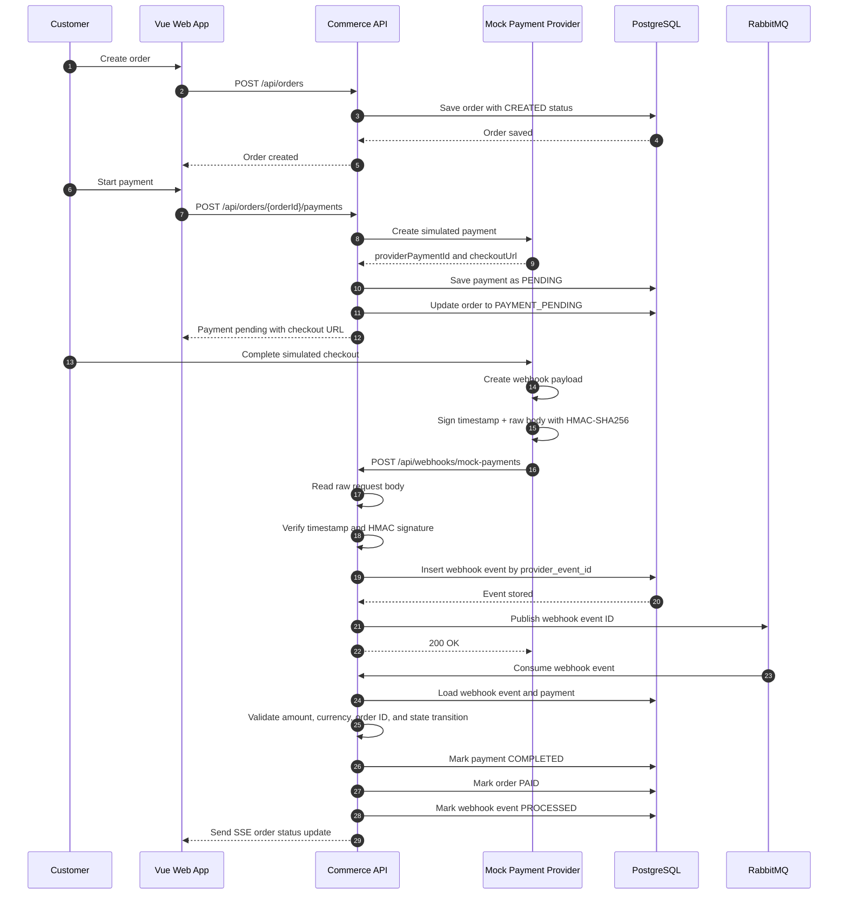
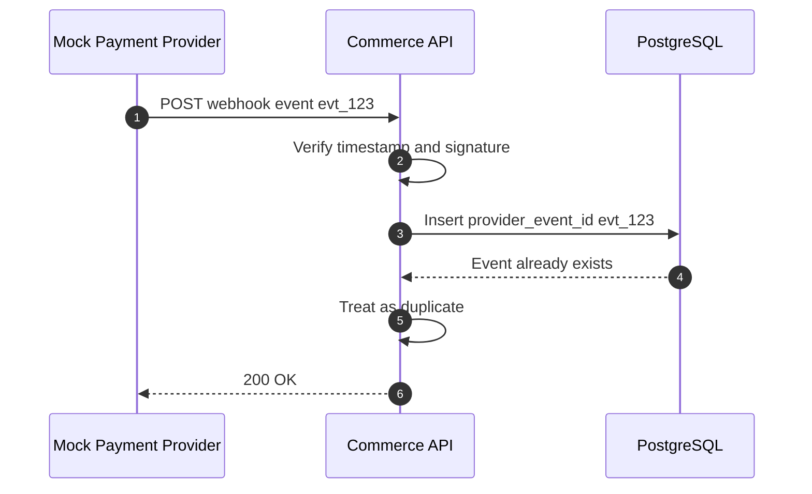
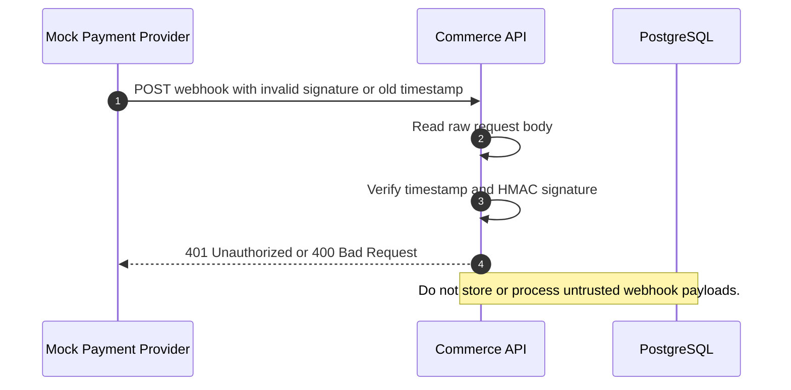
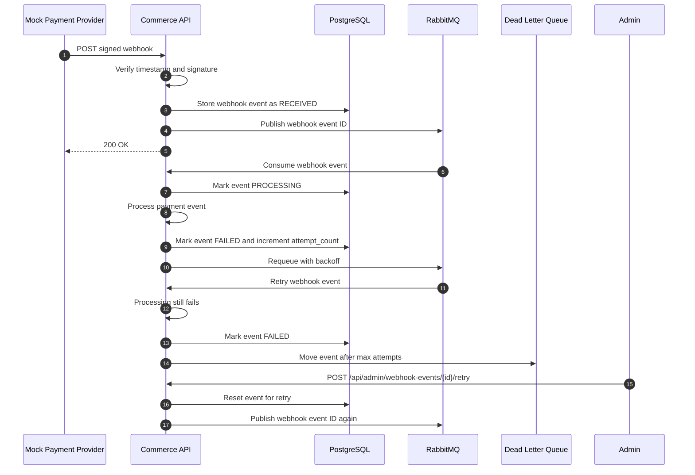

# Webhook Sequence Diagrams

This document shows the main webhook flows for the payment webhook learning project.

## 1. Successful Payment Webhook

The Commerce API should respond to the provider quickly after the webhook is verified, stored, and queued. Business processing happens asynchronously through the queue.

## 2. Duplicate Webhook Event

A duplicate event should not be processed again. Returning `200 OK` prevents the provider from retrying an event that the Commerce API has already accepted.

## 3. Invalid Signature Or Expired Timestamp

The receiver must verify the signature against the exact raw request body before parsing or trusting any JSON fields.

## 4. Processing Failure And Retry

The provider retry policy handles delivery failures. The queue retry policy handles failures after the webhook has already been accepted by the Commerce API.

## 5. Main State Changes

| Step | Payment status | Order status | Webhook event status |
|---|---|---|---|
| Order created | None | CREATED | None |
| Payment started | PENDING | PAYMENT_PENDING | None |
| Webhook accepted | PENDING | PAYMENT_PENDING | RECEIVED |
| Event processing starts | PENDING | PAYMENT_PENDING | PROCESSING |
| Payment completed | COMPLETED | PAID | PROCESSED |
| Payment failed | FAILED | PAYMENT_FAILED | PROCESSED |
| Processing error | Unchanged | Unchanged | FAILED |
| Duplicate event | Unchanged | Unchanged | IGNORED or existing status |

